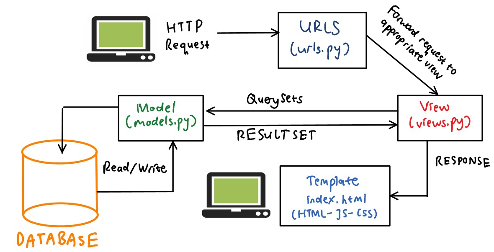
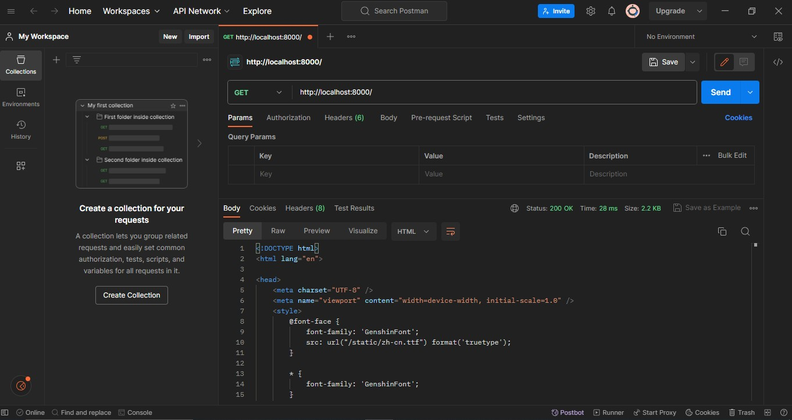
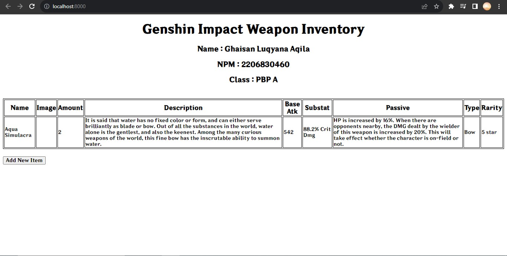
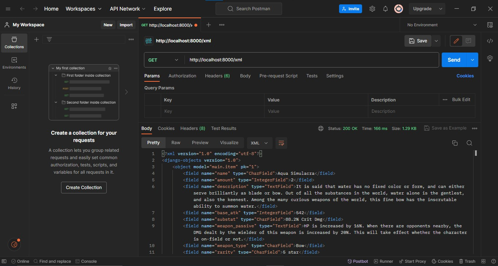
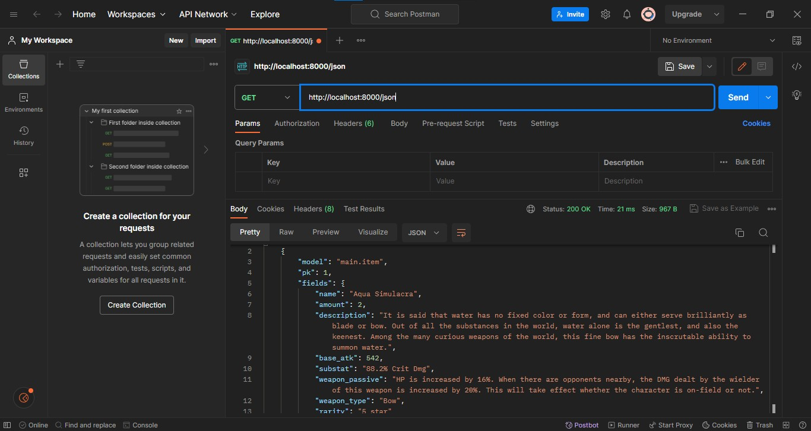
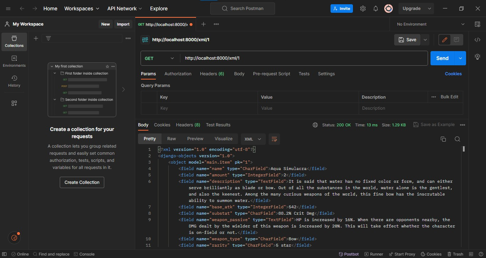
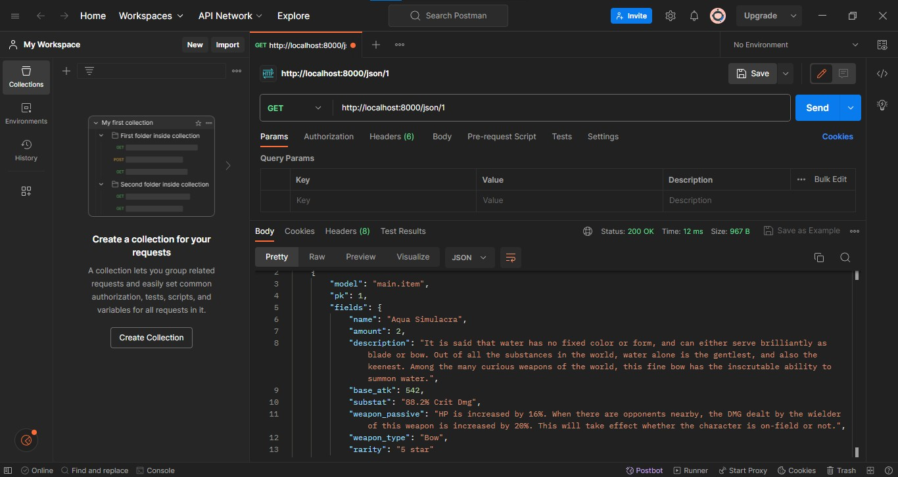

__Nama    : Ghaisan Luqyana Aqila__

__NPM     : 2206830460__

__Kelas   : PBP A__


Program ini didesain untuk membuat sebuah _Weapon Inventory_ untuk game Genshin Impact. 

Berikut adalah tautan menuju aplikasi yang sudah di-deploy : [ghaisan-luqyana-tugas.pbp.cs.ui.ac.id](ghaisan-luqyana-tugas.pbp.cs.ui.ac.id)

Berikut adalah shortcut untuk tugas :

- [Tugas 2](#tugas-2)
- [Tugas 3](#tugas-3)
- [Tugas 4](#tugas-4)
- [Tugas 5](#tugas-5)
- [Tugas 6](#tugas-6)

# Tugas 2

## Jelaskan bagaimana cara kamu mengimplementasikan checklist di atas secara step-by-step (bukan hanya sekadar mengikuti tutorial).

- Pada pembuatan project Django baru, saya membuat local directory dengan nama gi_wp_inventory dan melakukan inisiasi virtual environment (dengan command python -m venv env, kemudian env\Scripts\activate.bat untuk aktivasi) pada local directory tersebut. Kemudian setelah menjalankan virtual environment, saya membuat requirements.txt dengan beberapa dependencies dan melakukan instalasi Django (dengan command pip install -r requirements.txt) pada directory tersebut. Selanjutnya dibuat proyek Django bernama gi_wp_inventory (dengan command django-admin startproject gi_wp_inventory .). Pada ALLOWED_HOST di settings.py, ditambahkan nilai "*" untuk memberikan izin pada semua host. Setelah menjadikan gi_wp_inventory sebagai repositori Git, ditambahkan berkas .gitignore sebagai konfigurasi berkas dan directory yang diabaikan oleh Git. 
- Pada pembuatan main di project gi_wp_inventory, dijalankan command python manage.py startapp main, kemudian menambahkan 'main' pada INSTALLED_APPS di settings.py pada direktori proyek gi_wp_inventory. Setelah itu, saya menambahkan directory templates pada main yang berisi main.html dengan isi nama aplikasi, nama saya, npm, serta kelas PBP.
- Setelah pembuatan main, dilakukan routing pada proyek agar dapat menjalankan aplikasi main dengan menambahkan fungsi show_main pada path di urls.py di direktori main. Diberikan juga variabel app_name untuk memberikan nama unik pada pola URL dalam aplikasi.
- Pada pembuatan models di aplikasi main, dibuatlah sebuah class Item pada models.py. Pada class ini, saya membuat atribut-atribut yang diperlukan untuk mendeskripsikan atribut pada weapon, seperti name (type CharField), amount (type IntegerField), description (type TextField), base_atk (type IntegerField), substat (type CharField), weapon_passive (type TextField), weapon_type (type CharField), serta rarity (type CharField). Selanjutnya dijalankan migrasi model ke dalam basis data setelah membuat model.
- Pada views.py, ditambahkan function show_main dengan context berisi dictionary dengan isi name dan class untuk dikembalikan kepada template main.html yang akan menampilkan nama aplikasi, nama, serta kelas PBP. Pada template dilakukan modifikasi untuk main.html dengan mengubah menjadi {{ name }}, {{ npm }}, dan {{ class }} untuk menampilkan nilai dari variabel tersebut. Selain itu, main.html juga saya lakukan pencobaan untuk membuat gambaran tabel untuk tampilan aplikasi ke depannya. HTML ini juga akan disempurnakan nantinya supaya bisa lebih baik.
- Untuk membuat routing pada urls.py aplikasi main, ditambahkan path kosong ('') dan include dari aplikasi main ke berkas urls.py proyek (dengan include('main.urls')). Path diset kosong supaya ketika membuka aplikasi langsung menuju ke main.
- Setelah itu, dilakukan git add, commit, dan push ke dalam repository gi-wp-inventory yang berada di Github. Kemudian menuju ke website Adaptable dan dilakukan save settings and update deployment untuk melakukan deploy ke Adaptable.

## Buatlah bagan yang berisi request client ke web aplikasi berbasis Django beserta responnya dan jelaskan pada bagan tersebut kaitan antara urls.py, views.py, models.py, dan berkas html.


- Pertama-tama, client akan melakukan request kepada project Django dengan mengakses suatu URL. Kemudian Django akan menerima request tersebut dan meneruskan request tersebut ke View yang sesuai.
- Setelah View menerima request dari URL, view akan menjalankan QuerySets yang akan dikirimkan kepada Models. Setelah menerima QuerySets, Models akan melakukan read/write pada database dan akan mengirimkan sebuah ResultSet yang akan dikirimkan kembali kepada View.
- Dengan ResultSet yang telah diberikan, View akan melakukan generate respons kepada Template berupa index.html yang berisi HTML, Javascript, CSS.

## Jelaskan mengapa kita menggunakan virtual environment? Apakah kita tetap dapat membuat aplikasi web berbasis Django tanpa menggunakan virtual environment?

Virtual Environment digunakan untuk mengisolasi lingkungan pada proyek supaya antara proyek satu dan lainnya tidak saling bertabrakan atau tidak saling terpengaruhi. Dengan menggunakan virtual environment, masing-masing proyek dapat memiliki version Django dan Python yang berbeda sesuai dengan keperluan dari masing-masing proyek itu sendiri. Selain itu, virtual environment dapat mempermudah pembuat proyek untuk mengelola dependency yang diperlukan untuk proyek tersebut.
Django sendiri bisa dibuat tanpa menggunakan virtual environment, namun hal ini sangat rentan karena dapat memicu terjadinya "dependency hell". Sebagai contoh apabila kita memiliki dua buah proyek, yaitu ProjectA dan ProjectB, dimana masing-masing proyek ini memiliki dependency di library yang sama, yaitu ProjectC. Misalkan ProjectA membutuhkan version 1.0.0, sementara ProjectB membutuhkan version 2.0.0. Python memiliki keterbatasan dimana tidak bisa membedakan antara versi satu dengan lainnya di dalam site-packages directory. Masing-masing dari version 1.0.0 dan 2.0.0 akan memiliki nama yang sama di dalam directory yang sama. Dengan demikian, tidak akan ada perbedaan antara dua versi tersebut dan akan dianggap sama oleh Python sehingga ProjectA dan ProjectB membutuhkan versi yang sama untuk bisa dijalankan.

## Jelaskan apakah itu MVC, MVT, MVVM dan perbedaan dari ketiganya.

MVC (Model-View-Controller), MVT (Model-View-Template), MVVM (Model-View-ViewModel) adalah tiga jenis arsitektur desain yang digunakan ketika akan melakukan pengembangan aplikasi berbasis website. Di antara ketiga jenis ini, bagian yang sama adalah di dua huruf pertamanya, yaitu M (Model) dan V (View). Model merepresentasikan data dan logika bisnis aplikasi yang bertanggung jawab untuk mengambil dan menyimpan data serta memprosesnya. View merepresentasikan antarmuka pengguna aplikasi yang bertanggung jawab untuk menampilkan data dari Model dan menyediakan antarmuka bagi pengguna untuk berinteraksi dengan aplikasi. Berikut ini adalah perbedaan antara MVC, MVT, dan MVVM :
- MVC (Model-View-Controller) :  Pada MVC, C (Controller) merepresentasikan sebagai perantara antara Model dan View. Controller menerima input dari pengguna, memprosesnya dengan Model, dan memperbarui View. MVC memberikan pemisahan aspek yang jelas antara komponen aplikasi. Namun, MVC memiliki keterbatasan seperti kesulitan dalam melakukan pengujian (testing) dan Controller dapat menjadi penuh dengan logika.
- MVT (Model-View-Template) : Pada MVT, T (Template) merepresentasikan sebagai pengatur tampilan atau presentasi data yang akan ditampilkan oleh View. MVT memiliki kemampuan pengujian yang lebih baik dibandingkan dengan MVC dengan adanya pemisahan yang lebih jelas, namun hal ini dapat menyebabkan duplikasi kode antara View dan Template.
- MVVM (Model-View-ViewModel) : Pada MVVM, VM (ViewModel) merepresentasikan sebagai perantara antara Model dan View. ViewModel memisahkan tampilan dari logika bisnis dengan cara yang lebih kuat dibandingkan dengan Controller dan Template. MVVM memungkinkan pengujian unit lebih mudah dan juga memungkinkan penggunaan data binding untuk memperbarui View secara otomatis saat ViewModel berubah. hal ini dapat menyebabkan peningkatan kompleksitas.


# Tugas 3

## Apa perbedaan antara form `POST` dan form `GET` dalam Django?

Form `POST` dan form `GET` memiliki fungsi yang sama yaitu mengirimkan nilai (value) dari variabel ke sebuah file yang lain. Namun, keduanya memiliki perbedaan dalam hal pengiriman data tersebut.
1. `POST` merupakan method dalam pembuatan form dimana nilai variabel tidak ditampilkan ke dalam URL ketika data dipindahkan. `POST` ini biasa digunakan untuk melakukan input data melalui form dan digunakan untuk mengirim data-data penting seperti password, nama, alamat tempat tinggal, dan lainnya yang bersifat privasi. Karena hal ini, `POST` lebih aman dibandingkan dengan `GET`. Selain itu, pada `POST`, input data tidak dibatasi panjang string sehingga bisa dimasukkan data dengan panjang apapun. Untuk pengambilan variabel pada `POST` dilakukan dengan `request.POST.get`.
2. `GET` merupakan method dalam pembuatan form dimana nilai variabel ditampilkan ke dalam URL sehingga user dapat dengan mudah memasukkan nilai variabel baru. `GET` ini biasa digunakan untuk melakukan input data melalui link  dan digunakan untuk mengirim data-data yang tidak terlalu penting. Hal ini dikarenakan ketika user melakukan input data, nilai variabel yang dimasukkan akan terlihat di URL. Karena ini, `GET` kurang aman dibandingkan dengan `POST`. Selain itu, pada `GET`, input data dibatasi panjang string sampai 2047 karakter, sehingga data yang diinput tidak bisa sampai melebihi 2047 karakter. Untuk pengambilan variabel pada `GET` dilakukan dengan `request.GET.get`.

Sumber : [Penjelasan Singkat tentang POST & GET Django](https://gist.github.com/rririanto/442f0590578ca3f8648aeba1e25f8762), [Perbedaan Method POST dan GET Beserta Fungsinya](https://makinrajin.com/blog/perbedaan-post-dan-get/)

## Apa perbedaan utama antara XML, JSON, dan HTML dalam konteks pengiriman data?

1. **XML** adalah bahasa markah yang menyediakan aturan untuk menentukan data apa pun. Data dalam XML disimpan dalam bentuk elemen yang terdiri dari tag yang dapat menyimpan data dalam hierarki yang dalam dan rumit. XML digunakan untuk menyimpan dan melakukan transfer data secara umum. XML sering digunakan dalam berbagai konteks seperti konfigurasi aplikasi, pertukaran data antara sistem, dan penyimpanan data terstruktur.
2. **JSON** adalah format pertukaran data terbuka yang dapat dibaca baik oleh manusia maupun mesin. JSON bersifat independen dari bahasa pemrograman dan merupakan output API umum dalam berbagai aplikasi. Data dalam JSON disimpan dalam bentuk pasangan key-value dan dapat dibentuk menjadi sebuah array. JSON digunakan untuk pertukaran data antara server dan client dalam format yang mudah dipahami oleh JavaScript, meskipun juga digunakan dalam banyak bahasa pemrograman lainnya. JSON sendiri sangat populer dalam pengembangan aplikasi web dan API.
3. **HTML** adalah singkatan dari _Hypertext Markup Language_, yaitu bahasa markup standar untuk membuat dan menyusun halaman dan aplikasi web. HTML digunakan untuk membuat struktur dan tampilan halaman web. Masing-masing halaman web tersebut terdiri atas serangkaian tags yang tersusun untuk membentuk sebuah halaman website. Tag tersebut membuat hierarki yang menyusun konten hingga menjadi bagian, paragraf, heading, dan _block_ konten lainnya. 

Sumber : [JSON vs XML - Perbedaan Antara Berbagai Representasi Data](https://aws.amazon.com/id/compare/the-difference-between-json-xml/), [Apa Itu HTML? Fungsi dan Cara Kerja HTML](https://www.hostinger.co.id/tutorial/apa-itu-html)

## Mengapa JSON sering digunakan dalam pertukaran data antara aplikasi web modern?

- **_Simplicity_ dan _Readability_**
Dalam penulisannya, JSON menggunakan format pasangan key-value dan array sehingga lebih mudah untuk dibaca. Selain itu, JSON tidak membutuhkan special tag, atribut, ataupun skema seperti XML. JSON juga support untuk common data type seperti strings, numbers, booleans, nulls, objects, dan arrays.
- **_Compatibility_ dan _Interoperability_**
JSON kompatibel dengan berbagai macam platform, language, serta framework. Hal ini yang membuat JSON menjadi fleksibel untuk digunakan. JSON juga support untuk berbagai macam modern browser, web server, dan web API, sehingga memudahkan untuk melakukan pertukaran data antar sistem dan environment yang berbeda.
- **_Performance_ dan _Efficiency_**
JSON lebih cepat dan lebih ringan dibandingkan dengan XML karena JSON memiliki ukuran file yang lebih kecil dan struktur yang lebih sederhana. JSON tidak memerlukan closing tag, namespace, ataupun deklarasi, dimana hal ini dimiliki oleh XML sehingga XML terkesan lebih kompleks. Selain itu, JSON memiliki syntax yang lebih konsisten sehingga memudahkan untuk dilakukan _parse_ dan _generate_ oleh manusia ataupun mesin. JSON juga bisa meningkatkan kecepatan dan responsivitas sebuah aplikasi web karena mengurangi _bandwith_ dan waktu process yang diperlukan untuk transfer dan manipulasi data.

Sumber : [JSON untuk Aplikasi Web: Kelebihan dan Kekurangan](https://www.linkedin.com/advice/3/what-benefits-drawbacks-using-json-data)

## Jelaskan bagaimana cara kamu mengimplementasikan checklist di atas secara step-by-step (bukan hanya sekadar mengikuti tutorial).

1. Sebelum membuat input form untuk menambahkan objek model, saya membuat `base.html` pada folder `templates` di root folder sebagai template dasar dari html yang dibuat dan dibuat juga beberapa penyesuaian untuk CSS nya. Setelah itu, pada `DIRS` di `settings.py` di subdirektori `gi_wp_inventory`, ditambahkan `'templates'` sebagai base dir. Pada `main.html` dilakukan beberapa perubahan untuk `block content` dengan penyesuaian untuk isi dari body.
Untuk pembuatan form input data untuk menambahkan objek model, pertama dibuat `forms.py` untuk membuat struktur form yang dapat menerima data item baru. Setelah itu, diimport `ModelForm` dan `Item` dan dibuat class `ItemForm`. Deklarasi `model = Item` sehingga data dari form akan disimpan menjadi sebuah objek `Item`. Fields diisi dengan `["name", "amount", "description", "base_atk", "substat", "weapon_passive", "weapon_type", "rarity"]` sebagai atribut-atribut yang diminta inputnya untuk _weapon_ dalam inventory tersebut.
2. Pada pembuatan views, pada file `views.py` ditambahkan import `HttpResponseRedirect`, `ItemForm`, dan `reverse`. Setelah itu, dibuat fungsi baru `create_item` untuk menghasilkan formulir yang dapat menambahkan data item secara otomatis ketika data disubmit dari form. Pada `show_main`, ditambahkan `items = Item.objects.all()` dan `'items': items`. Setelah itu, pada `urls.py` di `main`, pada bagian `urlpatterns` ditambahkan path url untuk mengakses fungsi `create_item` yang sudah diimport sebelumnya. Selanjutnya dibuat file html baru dengan nama `create_item.html` pada direktori `main/templates` dimana ini akan menjadi pembuat item baru. Setelah itu, pada `main.html`, dilakukan beberapa penyesuaian pada `block content` untuk dilakukan looping setiap kali ada penambahan data item untuk dimasukkan ke dalam tabel, dan ditambahkan juga button untuk menambahkan item baru.
3. Untuk mengembalikan data dalam bentuk XML, selanjutnya diimport `HttpResponse` dan `serializers` serta dibuat fungsi `show_xml` pada `views.py`, dan dibuat variabel data di dalam fungsi tersebut untuk menyimpan hasil _query_ dari seluruh data dalam `Item`. Selanjutnya dibuat _return function_ berupa `HttpResponse` dengan parameter data hasil _query_ dalam format _xml_. Kemudian pada `urls.py` ditambahkan import fungsi `show_xml` dari yang telah dibuat dan tambahkan path url ke dalam `urlpatterns` sehingga fungsi yang sudah diimport dapat diakses.
4. Untuk mengembalikan data dalam bentuk JSON, diimport `HttpResponse` dan `serializers` serta dibuat fungsi `show_json` pada `views.py`, dan dibuat variabel data di dalam fungsi tersebut untuk menyimpan hasil _query_ dari seluruh data dalam `Item`. Selanjutnya dibuat _return function_ berupa `HttpResponse` dengan parameter data hasil _query_ dalam format _json_. Kemudian pada `urls.py` ditambahkan import fungsi `show_json` dari yang telah dibuat dan tambahkan path url ke dalam `urlpatterns` sehingga fungsi yang sudah diimport dapat diakses.
5. Untuk mengembalikan data berdasarkan ID dalam bentuk XML dan JSON, pada `views.py` ditambahkan fungsi `show_xml_by_id` dan `show_json_by_id`, kemudian masing-masing fungsi ditambahkan variabel `data` untuk menyimpan hasil query dari data dengan id tertentu yang ada pada `Item`. Setelah itu pada `urls.py` ditambahkan import `show_xml_by_id` dan `show_json_by_id`, kemudian tambahkan path url ke dalam `urlpatterns` sehingga fungsi yang sudah diimport dapat diakses.

## Screenshot Hasil Akses URL pada Postman

1. Show HTML


2. Show XML

3. Show JSON

4. Show XML By ID

5. Show JSON By ID



# Tugas 4

## Apa itu Django `UserCreationForm`, dan jelaskan apa kelebihan dan kekurangannya?

- `UserCreationForm` adalah salah satu dari banyak formulir bawaan yang disediakan oleh Django. Django `UserCreationForm` digunakan untuk membuat user baru yang dapat menggunakan aplikasi web kita. `UserCreationForm` memiliki 3 field: username, password1, password2 (yang pada dasarnya digunakan untuk konfirmasi password).
- Berikut ini adalah __kelebihan__ dari `UserCreationForm` :
1. __Mudah Digunakan__. `UserCreationForm` mudah untuk digunakan dan dapat disesuaikan dengan kebutuhan pembuat website / aplikasi.
2. __Integrasi dengan Model User Django__. Form ini dirancang untuk berintegrasi dengan baik dengan model user bawaan Django atau model custom user yang telah dibuat.
3. __Validasi Otomatis__. `UserCreationForm` melakukan validasi otomatis pada data yang dimasukkan oleh user, seperti memastikan bahwa password sesuai dengan persyaratan keamanan yang telah ditetapkan.
4. __Kustomisasi__. `UserCreationForm` bisa dilakukan kustomisasi secara bebas oleh pembuat website / aplikasi sesuai dengan kebutuhan masing-masing.
- Berikut ini adalah __kekurangan__ dari `UserCreationForm` :
1. __Pembatasan Fungsionalitas__. Fungsionalitas yang dimiliki oleh `UserCreationForm` sangatlah sederhana, sehingga pembuat harus menambahkan fitur-fitur tambahan jika ingin membuat sebuah form pendaftaran user yang lebih kompleks.
2. __Keterbatasan dalam Desain__. Tampilan dan desain form yang dimiliki oleh `UserCreationForm` sangat sederhana. Jika ingin membuat tampilan form yang lebih menarik atau responsif, maka kita perlu membuat tampilan formulir secara manual.
3. __Keamanan__. Meskipun `UserCreationForm` melakukan validasi otomatis terhadap password, masih perlu memastikan bahwa praktik keamanan yang tepat diterapkan dalam penggunaan form ini untuk menghindari adanya serangan yang tidak diinginkan seperti serangan _brute force_.

## Apa perbedaan antara autentikasi dan otorisasi dalam konteks Django, dan mengapa keduanya penting?

1. __Autentikasi__ adalah proses memverifikasi identitas user. Autentikasi umumnya melibatkan proses login dimana user harus memberikan kredensial seperti username dan password. Autentikasi bertujuan untuk memastikan bahwa hanya user yang sah yang memiliki izin untuk mengakses aplikasi kita. Dengan kata lain, autentikasi adalah proses memverifikasi identitas pengguna.
- Dalam konteks Django, Django menyediakan modul `django.contrib.auth` yang memiliki sistem autentikasi bawaan. Modul ini menyertakan views, forms, dan models yang membantu dalam proses autentikasi, seperti login, logout, dan pendaftaran user.
2. __Otorisasi__ proses menentukan perizinan user setelah mereka berhasil login ke dalam website / aplikasi. Otorisasi mengatur hak akses dan izin user berdasarkan peran atau peraturan tertentu. Otorisasi bertujuan untuk memastikan bahwa setelah autentikasi, user hanya memiliki akses ke bagian-bagian aplikasi / website yang sesuai dengan peran dan izin mereka.
- Dalam konteks Django, Django menyediakan sistem perizinan (_permissions_) yang memungkinkan pembuat website untuk mendefinisikan izin khusus pada objek (misalnya, apakah user tertentu dapat mengedit objek tertentu) atau tindakan (seperti menambah, mengubah, atau menghapus). Selain itu, dengan model Group, Django memungkinkan pengelompokan izin bersama-sama, sehingga memudahkan dalam pemberian izin.

## Apa itu _cookies_ dalam konteks aplikasi web, dan bagaimana Django menggunakan _cookies_ untuk mengelola data sesi pengguna?

- __Cookie HTTP__ (juga disebut cookie web, cookie Internet, cookie browser, atau cookie sederhana) adalah sepotong kecil data yang dikirim dari website dan disimpan di komputer user oleh website user saat user berselancar di dalam web. Teknologi ini dirancang untuk menjadi mekanisme bagi website untuk mengingat informasi _stateful_ (seperti barang yang ditambahkan dalam keranjang belanja di toko online) atau untuk merekam aktivitas penelusuran user. Cookies juga dapat digunakan untuk mengingat potongan informasi dan data yang sebelumnya dimasukkan user ke dalam form seperti nama, alamat, password.
- Dalam konteks Django, Django menggunakan _cookies_, khususnya cookie yang berisi identifikasi unik yang disebut "session ID", untuk mengidentifikasi _user session_. Ketika user terautentikasi, ID sesi disimpan di dalam cookie, yang kemudian digunakan untuk mengidentifikasi user saat melakukan login kembali ke server atau berpindah antar halaman.

## Apakah penggunaan _cookies_ aman secara default dalam pengembangan web, atau apakah ada risiko potensial yang harus diwaspadai?

Penggunaan cookies dalam pengembangan web dapat menjadi alat yang bermanfaat untuk menyimpan informasi di sisi klien (pada perangkat user) untuk berbagai keperluan, seperti autentikasi, user session, analisis, dan personalisasi. Namun, penggunaan cookies juga dapat memiliki potensi risiko keamanan seperti :
1. __Cross-Site Scripting (XSS)__. Ada potensi bahwa hacker dapat mencoba mencuri cookies user jika website yang menggunakan cookies vulnerable. Hal ini dapat menyebabkan hacker mendapatkan akses ke akun pengguna.
2. __Session Hijacking__. Jika cookies digunakan untuk mengelola user session, hacker dapat mencoba mencuri atau memodifikasi cookies session untuk mengambil alih user session.
3. __Cookie Theft__. Cookies yang tidak aman atau tidak terenkripsi dapat dicuri oleh hacker melalui berbagai teknik seperti _network sniffing_ atau serangan perantara.
4. __Privacy Concerns__. Penggunaan cookies untuk melacak perilaku user dapat menimbulkan masalah privasi dan dapat melibatkan persyaratan hukum tertentu seperti GDPR di Uni Eropa.

## Jelaskan bagaimana cara kamu mengimplementasikan checklist di atas secara step-by-step (bukan hanya sekadar mengikuti tutorial).

### Membuat Fungsi dan Form Registrasi

1. Menambahkan import `redirect`, `UserCreationForm`, dan `messages` pada bagian `views.py` pada subdirektori `main`.
2. Membuat fungsi `register` pada `views.py` dengan menambahkan kode sebagai berikut :
```py
def register(request):
    form = UserCreationForm()

    if request.method == "POST":
        form = UserCreationForm(request.POST)
        if form.is_valid():
            form.save()
            messages.success(request, 'Your account has been successfully created!')
            return redirect('main:login')
    context = {'form':form}
    return render(request, 'register.html', context)
```
3. Membuat berkas HTML baru dengan nama `register.html` pada folder `templates` pada direktori main dan menambahkan potongan kode sebagai berikut :
```html



    <title>Register</title>


  

<div class = "login">
    
    <h1>Register</h1>  

        <form method="POST" >  
              
            <table>  
                {{ form.as_table }}  
                <tr>  
                    <td></td>
                    <td><input type="submit" name="submit" value="Daftar"/></td>  
                </tr>  
            </table>  
        </form>

      
        <ul>   
              
                <li>{{ message }}</li>  
                  
        </ul>   
    

</div>  


```
4. Menambahkan import fungsi `register` pada `urls.py` dan menambahkan path url ke dalam `urlpatterns` dengan kode sebagai berikut :
```py
...
path('register/', register, name='register'),
...
```

### Membuat Fungsi Login

5. Pada pembuatan fungsi login, pertama-tama, pada `views.py` di subdirektori `main`, menambahkan import `authenticate` dan `login` dari `django.contrib.auth`. Setelah itu, dibuatlah fungsi `login_user` dengan menambahkan kode sebagai berikut :
```py
def login_user(request):
    if request.method == 'POST':
        username = request.POST.get('username')
        password = request.POST.get('password')
        user = authenticate(request, username=username, password=password)
        if user is not None:
            login(request, user)
            return redirect('main:show_main')
        else:
            messages.info(request, 'Sorry, incorrect username or password. Please try again.')
    context = {}
    return render(request, 'login.html', context)
```
6. Setelah dibuat fungsi `login_user`, dibuatlah berkas HTML baru dengan nama `login.html` pada folder `templates` di direktori `main` yang berisi kode sebagai berikut :
```html



    <title>Login</title>




<div class = "login">

    <h1>Login</h1>

    <form method="POST" action="">
        
        <table>
            <tr>
                <td>Username: </td>
                <td><input type="text" name="username" placeholder="Username" class="form-control"></td>
            </tr>
                    
            <tr>
                <td>Password: </td>
                <td><input type="password" name="password" placeholder="Password" class="form-control"></td>
            </tr>

            <tr>
                <td></td>
                <td><input class="btn login_btn" type="submit" value="Login"></td>
            </tr>
        </table>
    </form>

    
        <ul>
            
                <li>{{ message }}</li>
            
        </ul>
         
        
    Don't have an account yet? <a href="">Register Now</a>

</div>


```
7. Menambahkan import fungsi `login_user` pada `urls.py` dan menambahkan path url untuk fungsi tersebut dengan kode sebagai berikut :
```py
...
path('login/', login_user, name='login'),
...
```

### Membuat Fungsi Logout

8. Pada pembuatan fungsi logout, pertama-tama, pada `views.py` di subdirektori `main`, menambahkan import `logout` dari `django.contrib.auth`. Setelah itu, dibuatlah fungsi `logout_user` dengan menambahkan kode sebagai berikut :
```py
def logout_user(request):
    logout(request)
    return redirect('main:login')
```
9. Setelah dibuat fungsi logout, ditambahkan hyperlink tag untuk _Logout_ pada berkas `main.html` dengan kode sebagai berikut :
```html
...
<a href="">
    <button>
        Logout
    </button>
</a>
...
```
10. Setelah dibuat button logout, menambahkan import fungsi `logout_user` pada `urls.py` serta menambahkan path url untuk fungsi tersebut dengan kode sebagai berikut :
```py
...
path('logout/', logout_user, name='logout'),
...
```

### Merestriksi Akses Halaman Main

11. Ketika ingin membuat restriksi akses halaman `main`, menambahkan import `login_required` dari `django.contrib.auth.decorators` di `views.py`, kemudian menambahkan kode `@login_required(login_url='/login')` di atas fungsi `show_main` agar halaman `main` hanya dapat diakses oleh pengguna yang sudah login (terautentikasi).

### Menggunakan Data Dari Cookies

12. Untuk menggunakan data dari _Cookies_, tambahkan import `datetime`, `HttpResponseRedirect`, dan `reverse` pada `views.py`. Setelah itu, pada fungsi `login_user`, dilakukan penggantian kode yang ada pada blok `if user is not None` menjadi potongan kode berikut :
```py
...
if user is not None:
    login(request, user)
    response = HttpResponseRedirect(reverse("main:show_main")) 
    response.set_cookie('last_login', str(datetime.datetime.now()))
    return response
...
```
13. Pada fungsi `show_main`, ditambahkan kode `'last_login': request.COOKIES['last_login']` ke dalam variabel `context`.
14. Mengubah fungsi `logout_user` dengan kode sebagai berikut :
```py
def logout_user(request):
    logout(request)
    response = HttpResponseRedirect(reverse('main:login'))
    response.delete_cookie('last_login')
    return response
```
15. Pada `main.html`, ditambahkan potongan kode sebagai berikut untuk menampilkan data _last login_ :
```html
...
<h5>Sesi terakhir login: {{ last_login }}</h5>
...
```

### Menghubungkan Model `Product` dengan `User`

16. Untuk menghubungkan model `Item` dengan `User`, pada `models.py` ditambahkan import `User` dari `django.contrib.auth.models`. Kemudian pada class `Item` ditambahkan potongan kode sebagai berikut :
```py
class Item(models.Model):
    user = models.ForeignKey(User, on_delete=models.CASCADE)
    ...
```
17. Pada `views.py`, mengubah fungsi `create_item` menjadi sebagai berikut :
```py
def create_item(request):
 form = ItemForm(request.POST or None)

 if form.is_valid() and request.method == "POST":
     item = form.save(commit=False)
     item.user = request.user
     item.save()
     return HttpResponseRedirect(reverse('main:show_main'))
 ...
 ```
 18. Setelah itu, dilakukan perubahan pada fungsi `show_main` menjadi sebagai berikut :
 ```py
 def show_main(request):
    items = Item.objects.filter(user=request.user)

    context = {
        'name': request.user.username,
    ...
...
```
Yang terakhir adalah dilakukan migrasi model dengan `python manage.py makemigrations` dan mengaplikasikan migrasi yang dilakukan pada poin sebelumnya dengan `python manage.py migrate`.

# Tugas 5

## Jelaskan manfaat dari setiap _element selector_ dan kapan waktu yang tepat untuk menggunakannya.

1. __Element Selector__, merupakan selector yang berfungsi untuk memilih elemen HTML berdasarkan nama dari elemen yang di _select_. 
Element selector cocok digunakan untuk mengaplikasikan _style_ CSS pada semua elemen dengan tag yang sama. Sebagai contoh `p` untuk memilih semua paragraf dalam HTML:
```css
p {
  text-align: center;
  color: red;
}
```

2. __Class Selector__, merupakan selector yang berfungsi untuk memilih elemen HTML berdasarkan atribut _class_ yang di _select_. 
Class selector cocok digunakan untuk mengaplikasikan _style_ pada elemen yang memiliki karakteristik yang sama dan cocok untuk dikelompokkan dalam kelompok tertentu. Sebagai contoh, semua elemen dengan `class="center"` akan di _select_ untuk dibuat menjadi _center_ dan diwarnai merah:
```css
.center {
  text-align: center;
  color: red;
}
```

3. __ID Selector__, merupakan selector yang berfungsi untuk memilih elemen HTML berdasarkan atribut ID yang didefinisikan. 
ID selector cocok digunakan untuk ketika ingin mengaplikasikan _style_ khusus pada satu elemen tertentu dalam HTML. Hal ini karena ID merupakan elemen yang unik dan ID selector digunakan untuk satu elemen khusus. Contoh jika ingin mengaplikasikan dalam elemen dengan `id="para1"`:
```css
#para1 {
  text-align: center;
  color: red;
}
```

4. __Attribute Selector__, merupakan selector yang berfungsi untuk memilih elemen HTML berdasarkan atribut spesifik yang dipilih.
Attribute selector cocok digunakan ketika ingin mengaplikasikan _style_ atau pada elemen-elemen yang memiliki atribut tertentu. Sebagai contoh, jika ingin mengaplikasikan dalam elemen dengan atribut `draggable="true"`:
```css
p[draggable] {
    color: red;
}
```

5. __Universal Selector__, merupakan selector yang berfungsi untuk memilih semua elemen HTML dalam halaman.
Universal selector cocok digunakan ketika ingin mengaplikasikan _style_ untuk keseluruhan elemen HTML dalam halaman. Sebagai contoh kita ingin mengubah seluruh text menjadi _center aligned_ dan berwarna biru:
```css
* {
  text-align: center;
  color: blue;
}
```

Sumber : [CSS Selectors](https://www.w3schools.com/css/css_selectors.asp#:~:text=CSS%20selectors%20are%20used%20to,a%20specific%20relationship%20between%20them)

## Jelaskan HTML5 Tag yang kamu ketahui.

1. `<html>` : Tag ini adalah elemen _root_ dari setiap halaman web HTML dan berisi seluruh konten halaman web.
2. `<head>` : Tag ini berisi informasi tentang dokumen seperti judul halaman, meta tag, dan informasi lainnya yang tidak ditampilkan secara langsung di halaman.
3. `<title>` : Tag ini digunakan untuk menentukan judul halaman web yang akan ditampilkan di bilah judul browser.
4. `<meta>` : Tag ini digunakan untuk menyediakan informasi metadata tentang halaman, seperti _encoding character_, deskripsi, dan kata kunci.
5. `<body>` : Tag ini adalah elemen yang berisi semua konten yang akan ditampilkan di halaman web, seperti teks, gambar, dan elemen-elemen lainnya.
6. `<div>` : Tag ini adalah elemen yang digunakan untuk mengelompokkan dan mengatur konten dalam sebuah blok. Sering digunakan dalam CSS untuk membuat tata letak halaman.
7. `<p>` : Tag ini digunakan untuk menandai teks sebagai paragraf.
8. `` : Tag ini digunakan untuk menampilkan gambar di halaman web.
9. `<a>` : Digunakan untuk membuat tautan atau hyperlink ke halaman web lain atau sumber daya lainnya.
10. `<table>`, `<tr>`, `<td>`, `<th>` : Digunakan untuk membuat tabel dan mengatur data tabular.

Sumber : [HTML Tags](https://www.w3schools.com/TAGS/default.asp)

## Jelaskan perbedaan antara margin dan padding.

1. Margin : Merepresentasikan ruang di luar elemen HTML.
2. Padding : Merepresentasikan ruang di dalam elemen HTML, di antara tepi elemen dan kontennya sendiri.

Margin :
- Margin memungkinkan untuk menggunakan _auto setting_.
- Margin juga memungkinkan untuk menggunakan _negative values_.
- Tidak terpengaruh oleh _styling_ dari elemen yang lain.

Padding :
- Mencegah posisi text terlalu dekat dengan border.
- Tidak bisa dilakukan _auto padding_.
- Tidak bisa digunakan _negative values_.
- Dapat dipengaruhi oleh _styling_ dari elemen yang lain.

Sumber : [Margin vs Padding](https://mailchimp.com/resources/padding-vs-margin/#:~:text=Padding%20represents%20the%20amount%20of,whitespace%20available%20surrounding%20an%20element.)

## Jelaskan perbedaan antara framework CSS Tailwind dan Bootstrap. Kapan sebaiknya kita menggunakan Bootstrap daripada Tailwind, dan sebaliknya?

__DESAIN__

- Bootstrap menawarkan set class CSS dan komponen yang telah dirancang sebelumnya dengan tampilan yang cukup terstruktur dan konsisten. Ini cocok untuk proyek dengan desain tradisional yang membutuhkan kerangka kerja yang stabil dan mudah digunakan.
- Tailwind menganut pendekatan yang lebih "utility-first", di mana kita membangun antarmuka dengan menggabungkan class utilitas yang lebih kecil. Ini memberikan kebebasan kreatif yang lebih besar dan memungkinkan penggunaan class yang sangat spesifik.

__FLEKSIBILITAS__

- Bootstrap menawarkan kerangka kerja yang relatif terstruktur dengan banyak komponen yang telah dirancang sebelumnya. Ini memberikan stabilitas dan kemudahan penggunaan, tetapi mungkin memiliki batasan dalam hal fleksibilitas desain yang unik.
- Tailwind memberikan fleksibilitas yang lebih besar dengan pendekatan "utility-first" yang memungkinkan kita membangun desain yang sangat kustom sesuai kebutuhan. kita memiliki kendali penuh atas gaya dan tata letak dengan kombinasi class utilitas yang spesifik.

__UKURAN FILE__

- Bootstrap adalah kerangka kerja yang lebih besar dalam hal ukuran file karena menyediakan banyak fitur dan komponen yang siap pakai. Ini mungkin berdampak pada kecepatan pengunduhan dan performa halaman web.
- Tailwind dirancang untuk lebih ringan dalam hal ukuran file. Namun, ketika kita menggunakan banyak class utilitas dalam kode, ukuran file CSS dapat meningkat.

__EKOSISTEM PENGEMBANGAN__

- Bootstrap memiliki ekosistem yang sangat kuat dengan dokumentasi yang kaya, banyak tema dan template yang tersedia, serta dukungan komunitas yang luas. Ini membuatnya mudah untuk memulai dan mendapatkan sumber daya yang diperlukan.
- Tailwind juga memiliki ekosistem yang berkembang pesat dengan dokumentasi yang baik dan komunitas yang aktif, kita dapat menemukan banyak sumber daya, plugin, dan integrasi dengan kerangka kerja JavaScript seperti React atau Vue.

Sumber : [CSS Tailwind vs Bootstrap](https://codepolitan.com/blog/perbedaan-bootstrap-dan-tailwind)

## Jelaskan bagaimana cara kamu mengimplementasikan checklist di atas secara step-by-step (bukan hanya sekadar mengikuti tutorial).

1. Untuk menambahkan fitur `edit`, dibuat fungsi baru dengan nama `edit_item` yang menerima parameter `request` dan `id`. Setelah itu, dibuat berkas HTML baru dengan nama `edit_item.html` pada subdirektori `main/templates`, setelah itu lakukan _routing_ ke urlpatterns pada `urls.py`. Pada `main.html`, tambahkan button `Edit` dan pasang url `edit_item` untuk menjalankan fungsi edit item.

2. Untuk styling, pada masing-masing file dibuat _styling_ CSS dengan metode internal. Pertama-tama pada `base.html`, dibuat _styling_ sebagai berikut :
```css
<style>
    @font-face {
        font-family: "GenshinFont";
        src: url("") format("truetype");
    }

    * {
        font-family: "GenshinFont";
    }

    table, th, td {
        border: 1px solid black;
        margin-left: auto;
        margin-right: auto;
    }

    .centered-image {
        display: block;
        margin: 0 auto;
    }

    .centered-container {
        display: flex;
        justify-content: center;
        align-items: center;
    }

    #blue-button {
        width:50% ;
        background: linear-gradient(4deg, #756eca 6%, #5dcfcf 99%);
        color: white;
        border: 2px solid #25316D;
        border-radius: 10px;
        cursor: pointer;
        padding: 10px 10px;
        display: block
    }
</style>
```
Karena saya menggunakan custom font seperti Genshin Impact, maka digunakan `@font-face` untuk membuat `GenshinFont`. Setelah itu, diset supaya semua text menggunakan font ini. Untuk bagian kode lainnya merupakan styling umum seperti button dan positioning.

3. Pada `login.html`, internal CSS yang digunakan adalah sebagai berikut :
```css
body {
    background-image: url("");
    background-size: cover; /* Adjust to your preference */
    background-repeat: no-repeat;
    background-attachment: fixed; /* Keeps the background fixed while scrolling */
}

.login-container {
    display: flex;
    justify-content: center;
    align-items: center;
    height: 90vh;
    margin: auto;
}

.login {
    background-color: rgba(255, 255, 255, 0.8);
    border-radius: 5px;
    box-shadow: 0px 0px 10px rgba(0, 0, 0, 0.2);
    text-align: center;
    padding: 30px;
    width: 400px;
}
```
Pada bagian login ini, `body` digunakan untuk setting background image dari static folder pada login page. Login container digunakan untuk positioning, dan login sebagai box untuk tampilan login.

```html

```

Pada bagian ini juga ditambahkan image maskot dari static sebagai hiasan.

4. Pada `register.html`, internal CSS yang digunakan adalah sebagai berikut :
```css
<style>
    body {
        background-image: url("");
        background-size: cover; /* Adjust to your preference */
        background-repeat: no-repeat;
        background-attachment: fixed; /* Keeps the background fixed while scrolling */
    }

    .register-container {
        display: flex;
        justify-content: center;
        align-items: center;
        height: 90vh;
        margin: auto;
    }

    .register {
        background-color: rgba(255, 255, 255, 0.8);
        border-radius: 5px;
        box-shadow: 0px 0px 10px rgba(0, 0, 0, 0.2);
        text-align: center;
        padding: 30px;
        width: 400px;
    }
</style>
```
Pada bagian register ini, `body` digunakan untuk setting background image dari static folder pada register page. Register container digunakan untuk positioning, dan register sebagai box untuk tampilan register.

```html
<!-- Menampilkan pesan kesalahan untuk field ini jika ada -->

<tr>
    <td></td>
    <td>
        <ul>
            
            <li>{{ error }}</li>
            
        </ul>
    </td>
</tr>

```

Pada looping form, ditambahkan juga kode ini untuk menampilkan pesan jika pembuatan username dan password tidak sesuai ketentuan.

5. Pada `main.html`, internal CSS yang digunakan adalah sebagai berikut :
```css
<style>
  body {
    background-image: url("");
    background-size: cover; /* Adjust to your preference */
    background-repeat: no-repeat;
    background-attachment: fixed; /* Keeps the background fixed while scrolling */
  }

  .main-container {
    display: flex;
    justify-content: center;
    align-items: center;
  }

  .main {
    background-color: rgba(255, 255, 255, 0.8);
    background-size: cover;
    border-radius: 5px;
    box-shadow: 0px 0px 10px rgba(0, 0, 0, 0.2);
    text-align: center;
    width: 100%;
    height: 100vh;
  }

  #title {
    background:linear-gradient(4deg, #5dcfcf 6%, #ccd8e7 99%);
    border-radius:10px;
    border:1px solid;
    display:inline-block;
    padding:16px 31px;
    text-shadow:0px 1px 0px #2f6627;
  }
</style>
```

Pada bagian main ini, `body` digunakan untuk setting background image dari static folder pada main page. Main container digunakan untuk positioning, dan main sebagai box untuk tampilan main. ID selector title untuk styling khusus untuk `<h1>` pada main page.

6. Pada `create_item.html`, _styling_ yang digunakan sama seperti pada `main.html` dan hanya dengan beberapa perubahan positioning.

# Tugas 6

## Jelaskan perbedaan antara asynchronous programming dengan synchronous programming.

1. __Asynchronous programming__ proses jalannya program bisa dilakukan secara bersamaan tanpa harus menunggu proses antrian. Dalam _asynchronous programming_, tugas atau operasi yang memakan waktu tidak menghalangi eksekusi tugas lainnya. Sebaliknya, aplikasi dapat melanjutkan eksekusi tugas lainnya sambil menunggu hasil dari tugas yang asinkron. Tugas asinkron tidak menghentikan eksekusi program utama. Hal ini memungkinkan aplikasi untuk tetap responsif, bahkan jika ada banyak operasi yang memakan waktu.

2. __Synchronous programming__ adalah proses jalannya program secara _sequential_. Dalam _synchronous programming_, tugas atau operasi dieksekusi secara berurutan, artinya setiap tugas harus menunggu tugas sebelumnya selesai sebelum dapat dijalankan. Jika tugas memakan waktu lama, maka seluruh aplikasi atau program akan terhenti (_blocking_) hingga tugas tersebut selesai. Hal ini dapat mengakibatkan kinerja aplikasi yang buruk, terutama dalam aplikasi berbasis antarmuka pengguna (GUI) yang merespons lambat.

Sumber : [Memahami Synchronous dan Asynchronous dalam Pemrograman](https://community.algostudio.net/memahami-synchronous-dan-asynchronous-dalam-pemrograman/), [Asynchronous vs Synchronous Programming](https://binus.ac.id/malang/2022/05/asynchronous-vs-synchronous-programming/)

## Dalam penerapan JavaScript dan AJAX, terdapat penerapan paradigma event-driven programming. Jelaskan maksud dari paradigma tersebut dan sebutkan salah satu contoh penerapannya pada tugas ini.

__Paradigma *event-driven programming*__ adalah pendekatan dalam pemrograman di mana eksekusi program dikendalikan oleh peristiwa atau kejadian yang terjadi. Dalam konteks JavaScript dan AJAX, paradigma ini sangat umum digunakan karena keduanya sering digunakan untuk mengembangkan aplikasi web yang harus merespons interaksi dari pengguna atau permintaan jaringan.

Penjelasan dari paradigma _event-driven programming_ adalah sebagai berikut:
1. __Program merespons kejadian__
Program akan menjalankan tindakan atau kode tertentu ketika suatu kejadian atau peristiwa tertentu terjadi. Kejadian ini bisa berasal dari berbagai sumber, seperti tindakan pengguna (misalnya, klik tombol), permintaan jaringan yang selesai, atau perubahan status elemen HTML.
2. __Tidak ada urutan yang berurutan__
Dalam paradigma ini, program tidak selalu dieksekusi secara berurutan dari atas ke bawah. Sebaliknya, program berjalan dalam mode "siap sedia" dan menunggu kejadian tertentu untuk merespons.
3. __Pemisahan logika__
Paradigma ini memungkinkan pemisahan logika program ke dalam tindakan atau _handler_ yang merespons kejadian tertentu. Hal ini dapat membuat kode menjadi lebih mudah dimengerti.

Contoh penerapannya dalam tugas ini adalah sebagai berikut :
```js
document.getElementById("button_add").onclick = addProduct
```
Ketika elemen dengan ID `button_add` di-klik, fungsi `addProduct` akan dijalankan.

Sumber : [Paradigma Pemrograman Event-Driven](https://osf.io/3s8tw/download#:~:text=Event%2DDriven%20programming%20juga%20bisa,berupa%20pesan%20dari%20program%20lainnya.)

## Jelaskan penerapan asynchronous programming pada AJAX.

__Penerapan asynchronous programming pada AJAX__ adalah salah satu contoh yang paling umum dari penggunaan pemrograman asinkron dalam pengembangan web. AJAX adalah teknologi yang memungkinkan untuk mengambil atau mengirim data dari atau ke server tanpa harus memuat ulang seluruh halaman web. Pada dasarnya, AJAX memungkinkan untuk menjalankan operasi secara asinkron, sehingga halaman web tetap responsif tanpa menghalangi pengguna.

AJAX bukanlah teknologi dan bukan pula bahasa pemrograman. AJAX adalah sekumpulan teknik pengembangan web. Pada umumnya sistem ini terdiri atas:
- __HTML/XHTML__ sebagai bahasa utama dan __CSS__ untuk menampilkan data.
- __The Document Object Model (DOM)__ untuk menampilkan data yang dinamis beserta interaksinya.
- __XML__ untuk pertukaran data, sedangkan XSLT untuk manipulasi data. Sebagian besar developer mulai mengganti XML dengan 
- JSONkarena bentuknya yang mendekati JavaScript.
- __Objek XMLHttpRequest__ untuk komunikasi tidak langsung (_asynschronous_).
- __Bahasa pemrograman JavaScript__ untuk menyatukan semua teknologi ini.

Sumber : [Apa Itu AJAX dan Bagaimana Cara Kerjanya?](https://www.hostinger.co.id/tutorial/apa-itu-ajax)

## Pada PBP kali ini, penerapan AJAX dilakukan dengan menggunakan Fetch API daripada library jQuery. Bandingkanlah kedua teknologi tersebut dan tuliskan pendapat kamu teknologi manakah yang lebih baik untuk digunakan.

__Fetch API__
- Fetch API adalah bagian dari standar JavaScript modern dan relatif ringan. Fetch API merupakan API yang terpisah dan tidak memerlukan library eksternal. Hal ini membuatnya lebih efisien dalam hal ukuran dan kinerja.
- Fetch API adalah teknologi yang lebih baru dan mencerminkan prinsip desain dan kebijakan modern. Ini mendukung Promises, sehingga lebih cocok untuk pemrograman asinkron yang lebih bersih.
- Karena Fetch API adalah bagian dari JavaScript standar, kita dapat mengandalkan dukungan yang berkelanjutan dari browser. Ini juga membuat kode menjadi lebih _portable_ dan tidak bergantung pada libray eksternal.
- Meskipun mendukung browser modern dengan baik, beberapa versi browser yang lebih lama mungkin tidak mendukung Fetch API. Namun, Anda dapat menggunakan polifil (polyfill) untuk menambahkan dukungan di browser lama.

__Library jQuery__
- jQuery adalah library JavaScript yang cukup besar yang mencakup banyak fitur lain selain AJAX. Jika hanya memerlukan fungsionalitas AJAX, penggunaan jQuery akan terasa lebih berat dan terkesan berlebihan.
- jQuery telah ada selama beberapa waktu, dan meskipun masih berguna, beberapa aspek desain dan kebijakan dalam jQuery mungkin tidak sebanding dengan pendekatan yang lebih modern.
- Library eksternal seperti jQuery memerlukan pemeliharaan khusus dan pembaruan terpisah dari kode aplikasi. Pembaruan versi jQuery atau perbaikan keamanan mungkin perlu dipantau dan diimplementasikan secara manual.
- jQuery telah dirancang untuk memiliki kompatibilitas yang sangat baik dengan berbagai versi browser, termasuk yang lebih tua. Oleh karena itu, jika menggunakan browser dengan versi yang lebih lama, jQuery bisa menjadi pilihan yang lebih aman.

Dengan demikian, penggunaan Fetch API akan menjadi solusi yang lebih baik, terutama dalam pengembangan aplikasi web modern. Fetch API lebih ringan, sesuai dengan standar, dan mendukung pembuatan _asynchronous programming_ supaya lebih mudah dipahami.

Sumber : [Difference Between Fetch and jQuery](https://stackoverflow.com/questions/43017576/what-is-the-difference-between-fetch-and-jquery-ajax)

## Jelaskan bagaimana cara kamu mengimplementasikan checklist di atas secara step-by-step (bukan hanya sekadar mengikuti tutorial).

1. Pertama-tama dibuat fungsi `get_product_json` untuk mengembalikan data JSON dengan pada `views.py`. Kemudian dibuat fungsi `add_product_ajax` untuk menambahkan item dengan AJAX dengan menyesuaikan _fields_ seperti berikut :
```py
@csrf_exempt
def add_product_ajax(request):
    if request.method == 'POST':
        name = request.POST.get("name")
        amount = request.POST.get("amount")
        description = request.POST.get("description")
        base_atk = request.POST.get("base_atk")
        substat = request.POST.get("substat")
        weapon_passive = request.POST.get("weapon_passive")
        weapon_type = request.POST.get("weapon_type")
        rarity =  request.POST.get("rarity")
        user = request.user

        new_product = Item(name=name, amount=amount, description=description, base_atk=base_atk, substat=substat, weapon_passive=weapon_passive, 
                           weapon_type=weapon_type, rarity=rarity, user=user)
        new_product.save()

        return HttpResponse(b"CREATED", status=201)

    return HttpResponseNotFound()
```

2. Setelah itu dibuat routing path pada `urls.py` untuk `get_product_json` dan `add_product_ajax`.

3. Untuk menampilkan data _item_ dengan `Fetch()` API, pertama-tama table diubah menjadi kode sebagai berikut :
```html
<table id="product_table" class="table" style="width: 100%;"></table>
```

4. Kemudian dibuat block `<script>` dan ditambahkan fungsi baru dengan nama `getProducts()` dan `refreshProducts()` untuk mendapatkan data serta me-_refresh_ data item secara _asynchronous_, dimana untuk `refreshProducts()` disesuaikan dengan table yang telah dibuat sebelumnya.

```js
<script>
  async function getProducts() {
    return fetch("").then((res) => res.json())
  }
  ...
</script>
```

```js
<script>
    ...
    async function refreshProducts() {
        document.getElementById("product_table").innerHTML = ""
        const products = await getProducts()
        let htmlString = 
        `<thead>
            <tr style="text-align: center;">
            <th>Name</th>
            <th>Image</th>
            <th>Amount</th>
            <th>Description</th>
            <th>Base Atk</th>
            <th>Substat</th>
            <th>Passive</th>
            <th>Type</th>
            <th>Rarity</th>
            <th>Options</th>
            </tr>
        </thead>`
    products.forEach((item) => {
      htmlString +=
      `<tbody>
        <tr style="text-align: center;">
          <td>${item.fields.name}</td>
          <td></td>
          <td>${item.fields.amount}</td>
          <td>${item.fields.description}</td>
          <td>${item.fields.base_atk}</td>
          <td>${item.fields.substat}</td>
          <td>${item.fields.weapon_passive}</td>
          <td>${item.fields.weapon_type}</td>
          <td>${item.fields.rarity}</td>
          <td>
              <button onClick="increase_amount(${item.id})">Add Amount</button>
              <button onClick="decrease_amount(${item.id})">Reduce Amount</button>
              <button onClick="delProduct(${item.pk})">Delete Item</button>
              <button onClick="edit_item(${item.pk})">Edit</button>
          </td>
        </tr>
      </tbody>`
    })

    document.getElementById("product_table").innerHTML = htmlString
  }

  refreshProducts()
  ...
```

5. Setelah itu, dibuat modal sebagai _Form_ untuk menambahkan item melalui AJAX, dan dibuat fungsi `addProduct()` pada block `<script>` dan menambahkan fungsi `onclick` pada button addProduct untuk menjalankan fungsi `addProduct()` :
```js
function addProduct() {
    fetch("", {
      method: "POST",
      body: new FormData(document.querySelector('#form'))
    }).then(refreshProducts)

    document.getElementById("form").reset()
    return false
  }
```

```js
<script>
    ...
    document.getElementById("button_add").onclick = addProduct
</script>
```